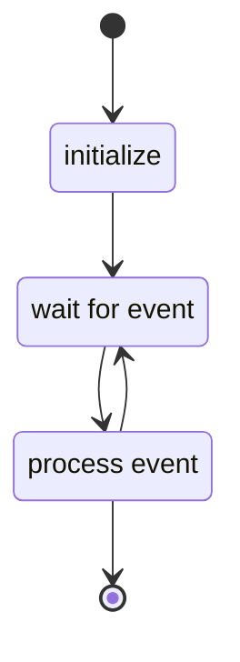
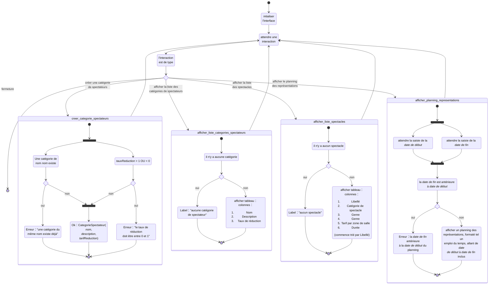

# Lot 10.1.2 : diagramme d'activité

Diagrammes d'activité Mermaid ([documentation](https://mermaid.js.org/syntax/stateDiagram-v2.html))

## Interface utilisateur

This is what any UI actually does:

## Diagramme complet

