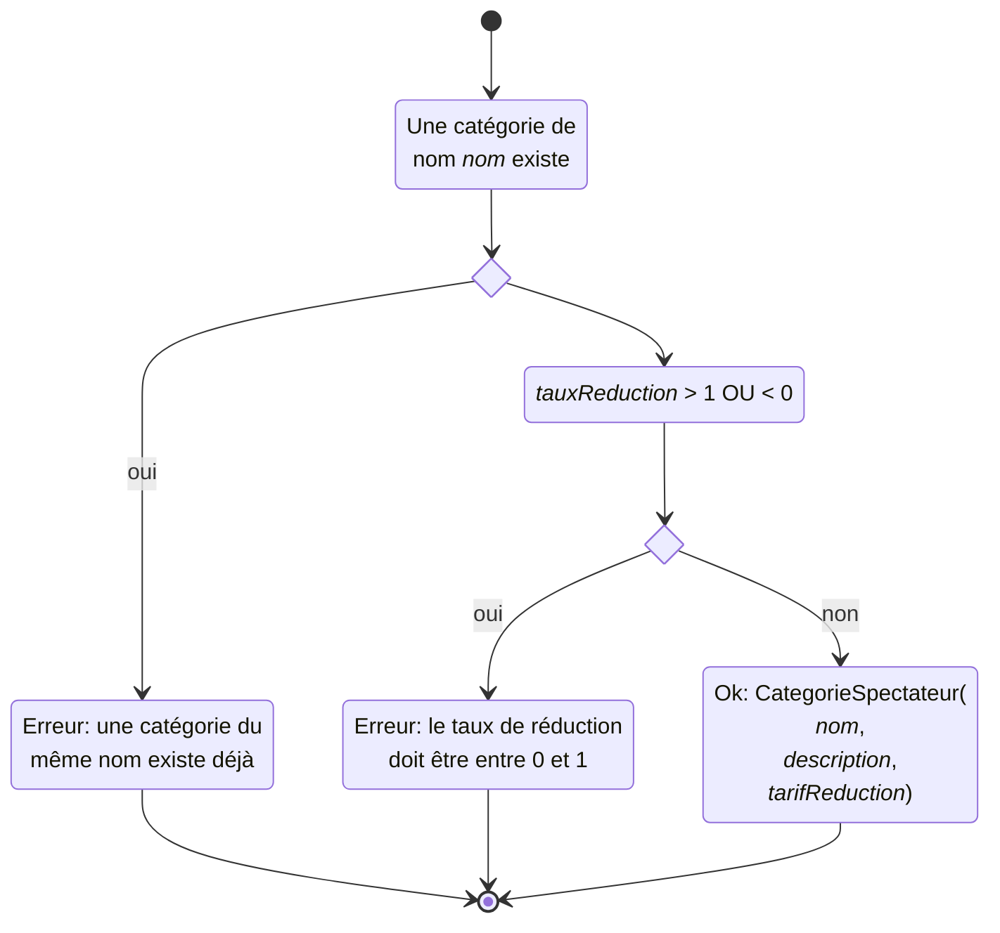
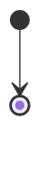

# Lot 10.1.2 : diagramme d'activité

Diagrammes d'activité Mermaid ([documentation](https://mermaid.js.org/syntax/stateDiagram-v2.html))

## Créer une catégorie de spectateur

### Entrée

nom|type|description|contrainte enforcée
-|-|-|-
nom|chaîne|nom de la catégorie|uncitié
description|chaîne|description de la catégorie
tauxReduction|réel|taux de réduction|$\in[0;1]$

### Flux

### Sortie

Une nouvelle catégorie de spectateurs (Ok) OU un message d'erreur (Erreur)

## Affichage de la liste des catégories de spectateur

### Entrée

### Flux

### Effet secondaire

## Affichage de la liste des spectacles

Triée par nom de spectacle.

Contient le tarif de chaque catégorie de spectateurs par zone pour chaque spectacle.

## Affichage du planning des représentations

Sur une période choisie par l'utilisateur.

